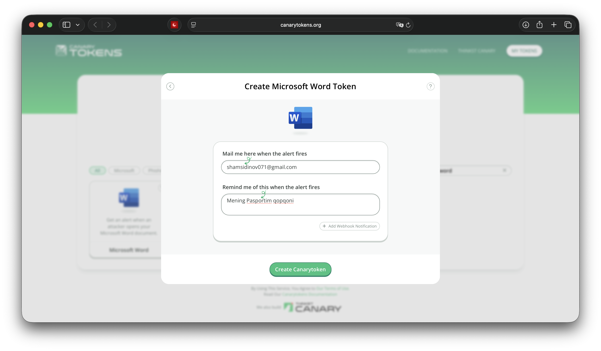
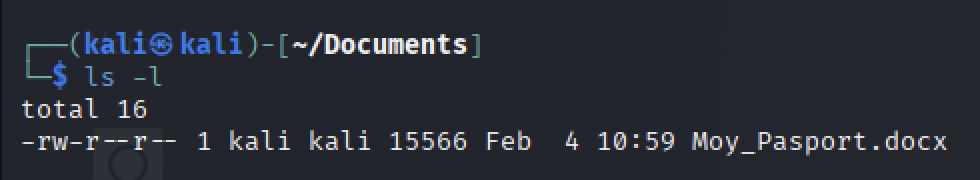
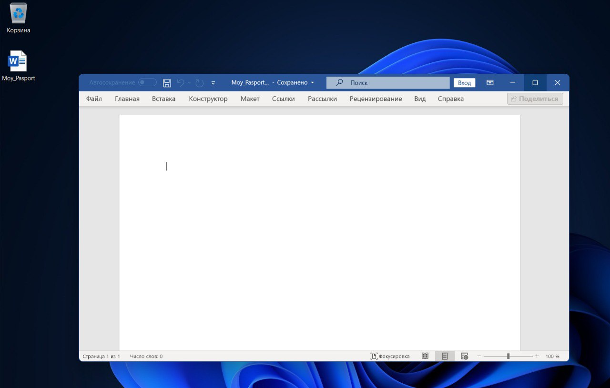

# Himoya faqat kutish degani emas

Kiberxavfsizlikda ko'pchilik faqat "devor qurish" (firewall, antivirus) bilan shug'ullanadi. Lekin haqiqiy himoyachi dushman ichkariga kirganini ham sezishi kerak.

**CanaryTokens** — bu xakerlar uchun raqamli qopqon. Tizimi: siz jozibali ko'rinadigan soxta fayl (masalan, "Pasportim" yoki "Parollar") yaratasiz va uni serveringizga tashlab qo'yasiz. Agar kimdir bu faylni o'g'irlab, ochib ko'rsa — **Tamom!** Sizga darhol uning IP manzili va qayerda ekanligi haqida xabar keladi.

Bugun biz "Moy_Pasport.docx" nomli soxta fayl yasaymiz va u qanday ishlashini ko'ramiz.

---

# 1-qadam: Qopqonni tayyorlash

Buning uchun bizga hech qanday murakkab dastur kerak emas, hammasini **CanaryTokens** bepul servisi bajarib beradi.

1.  **Canarytokens.org** saytiga kiring.
2.  Token turini tanlang: **"MS Word .docx"**.
3.  **Email** manzilingizni kiriting (Xabar shu yerga keladi).
4.  Eslatma sifatida biror narsa yozing (Masalan: "Mening Pasportim qopqoni").

---

# 2-qadam: "O'lja"ni joylashtirish

Sayt sizga `.docx` fayl yuklab beradi. Hozir bu fayl oddiy ko'rinishda. Xakerni qiziqtirish uchun uning nomini o'zgartiramiz.

Fayl nomini **`Moy_Pasport.docx`** yoki **`Xodimlar_Oyligi.docx`** deb o'zgartiring.

Uni eng ko'zga ko'rinadigan joyga, masalan, **Desktop** (Ish stoli) yoki **Documents** papkasiga tashlab qo'ying.

---

# 3-qadam: Qopqonning ishlash prinsipi

Endi qiziq joyiga keldik. Xaker tizimingizga kirdi deylik. U minglab fayllar ichidan birinchi bo'lib nimani qidiradi? Albatta, "Pasport", "Parol" yoki "Oylik maosh" kabi so'zlarni.

U `Moy_Pasport.docx` faylini ko'radi va xursand bo'lib uni o'z kompyuteriga ko'chirib oladi.

Faylni ochishi bilan, Word hujjati ichiga yashirilgan kichik kod (veb-bug) CanaryTokens serveriga signal yuboradi. Foydalanuvchi buni sezmaydi, hujjat oddiy ochiladi yoki "Xatolik" deb ko'rsatadi.

Keling, o'zimiz faylni ochib ko'ramiz (Sinov tariqasida).

---

# 4-qadam: Signalni qabul qilish

Fayl ochilgan zahoti telefoningiz yoki kompyuteringizdagi pochtaga xabar keladi.

Xabarda quyidagi ma'lumotlar bo'ladi:
* **Vaqt:** Qachon ochilgani.
* **IP Manzil:** Faylni ochgan odamning IP manzili.
* **Qurilma:** Qanday brauzer yoki dastur ishlatgani.

---

# Xulosa

Bu usul **"Active Defense"** (Faol Himoya) deb ataladi. Biz shunchaki hujum bo'lishini kutib o'tirmadik, balki dushmanni aniqlash uchun tuzoq qo'ydik.

Agar sizning serveringiz yoki kompyuteringizdan muhim hujjatlar o'g'irlansa, CanaryTokens orqali buni darhol bilib olasiz va chora ko'rishga ulgurasiz.

> **Eslatma:** Bu usul faqat qonuniy maqsadlarda, o'zingizga tegishli tizimlarni himoya qilish uchun ishlatilishi kerak.