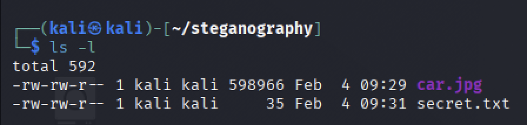
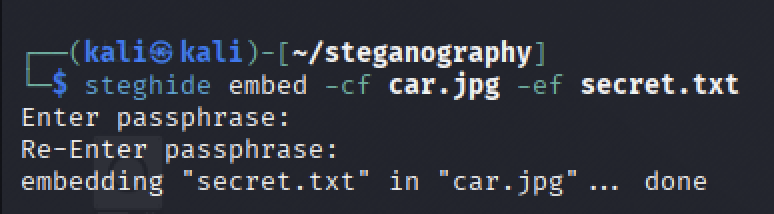
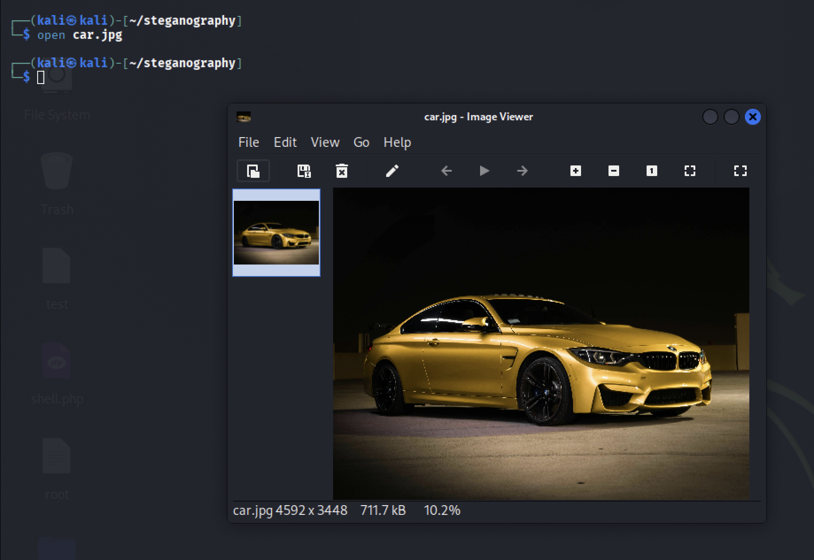

# Steganografiya nima?

Ko'pchilik "ma'lumotni himoyalash" deganda uni shifrlashni (kodlashni) tushunadi. Lekin shifrlangan faylga qaragan odam unda qandaydir sir borligini darhol sezadi.

**Steganografiya** esa boshqacha ishlaydi. Uning maqsadi — ma'lumotning borligini umuman **sezdirmaslik**. Masalan, siz oddiy manzarali rasmni birovga yuborasiz, lekin uning ichida maxfiy matn yoki fayl yashiringan bo'ladi. Tashqaridan qaraganda u shunchaki oddiy rasm.

Bugun Kali Linux tizimidagi mashhur `steghide` vositasi yordamida buni qanday amalga oshirishni ko'rib chiqamiz.

---

# 1-qadam: Kerakli fayllarni tayyorlash

Bizga tajriba uchun ikkita narsa kerak:
1.  **Tashuvchi fayl:** Bitta oddiy rasm (masalan, `car.jpg`).
2.  **Yashiriluvchi fayl:** Ichida siri bor matnli fayl (masalan, `secret.txt`).

Keling, terminalda oddiy matn faylini yaratib olamiz:

```bash
echo "Bu juda maxfiy xabar! Parol: 12345" > secret.txt
```

Hozir papkamizda rasm va matn fayli tayyor turibdi.



---

# 2-qadam: Ma'lumotni rasm ichiga joylash (Embed)

Endi `steghide` yordamida matnni rasmning piksellari orasiga joylaymiz. Buning uchun terminalga quyidagi buyruqni kiritamiz:

```bash
steghide embed -cf car.jpg -ef secret.txt
```

* **`-cf` (Cover File):** Qaysi rasm ichiga yashiramiz? (`car.jpg`)
* **`-ef` (Embed File):** Nimani yashiramiz? (`secret.txt`)

Buyruqni kiritganingizda tizim sizdan **parol** so'raydi. Parolni eslab qoling, chunki keyinchalik ma'lumotni olish uchun u kerak bo'ladi.



---

# 3-qadam: Natijani tekshirish

Jarayon tugagach, `car.jpg` rasmini ochib ko'ring.

Qizig'i shundaki, rasmda **hech qanday o'zgarish yo'q**. Rangi, tiniqligi va ko'rinishi xuddi oldingidek. Fayl hajmi ham deyarli o'zgarmaydi. Oddiy foydalanuvchi bu rasmda sir yashiringanini payqay olmaydi.



---

# 4-qadam: Ma'lumotni qaytarib olish (Extract)

Tasavvur qiling, bu rasmni qabul qilib oluvchi odamsiz. Ichidagi xabarni o'qish uchun nima qilish kerak?

Sizga faqat rasm va kelishilgan parol kerak bo'ladi. Ma'lumotni ajratib olish uchun quyidagi buyruq ishlatiladi:

```bash
steghide extract -sf car.jpg
```

* **`-sf` (Stego File):** Sir yashiringan fayl nomi.

Parolni kiritishingiz bilan, yashiringan `secret.txt` fayli paydo bo'ladi. Uni o'qib ko'ramiz:

```bash
cat secret.txt
```

Natija: Biz yashirgan xabar muvaffaqiyatli tiklandi.


---

# Xulosa

Ko'rib turganingizdek, **hamma fayl ham tashqaridan ko'ringanidek oddiy emas.**

Steganografiya kiberxavfsizlikda ma'lumotlarni yashirin uzatish, raqamli imzolarni joylashtirish va CTF musobaqalarida keng qo'llaniladi. Bu usul fayllarni himoyalashning qo'shimcha va samarali uslubi hisoblanadi.